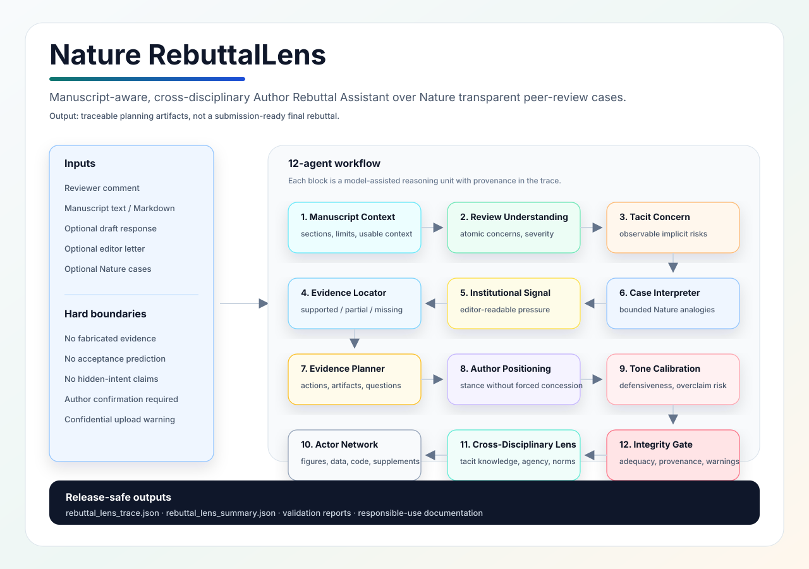

# Nature RebuttalLens

[](pyproject.toml)
[](LICENSE)
[](docs/OPEN_SOURCE_V0_1_COMPLETION_STATUS_zh.md)
[](docs/REBUTTAL_LENS_WORKFLOW_zh.md)

**Nature RebuttalLens is a manuscript-aware, cross-disciplinary Author Rebuttal Assistant workflow built from Nature transparent peer-review interaction cases.**

It helps authors interpret reviewer comments with structure: what the reviewer explicitly asks for, what risk may sit behind the comment, what evidence in the manuscript is already usable, what still needs author confirmation, and how similar Nature review interactions can be used as bounded historical analogies.

This is an independent open-source research project. It is not affiliated with, endorsed by, or operated by Nature Portfolio or Springer Nature.



## What The System Does

Nature RebuttalLens turns a reviewer comment, optional manuscript text, optional draft response, and optional retrieved Nature peer-review cases into a traceable assistant workflow.

The system is designed to:

- identify explicit reviewer concerns and possible tacit risks;
- connect reviewer concerns back to manuscript evidence when manuscript text is provided;
- interpret institutional and editor-facing signals without claiming access to hidden reviewer intent;
- retrieve and interpret similar Nature review-response cases as historical analogies;
- plan evidence actions, response structure, tone, author positioning, and integrity checks;
- produce a recorded workflow trace that can be inspected, evaluated, and improved.

It is not a final rebuttal generator, acceptance predictor, reviewer replacement, or tool for inventing experiments, fabricating evidence, or making commitments the authors cannot support.

| Capability | Output |
| --- | --- |
| Reviewer understanding | Concern map and observable textual evidence |
| Tacit risk interpretation | Risk notes without claiming private reviewer psychology |
| Manuscript evidence location | Supported / partial / missing evidence map over supplied manuscript text |
| Nature case interpretation | Historical case analogies with transfer boundaries |
| Evidence action planning | Required artifacts and author-confirmation questions |
| Author positioning | Response stance options, not forced concessions |
| Tone and commitment calibration | Defensive tone, overclaim, and unsupported commitment warnings |
| Actor-network mapping | Evidence carriers such as figures, datasets, code, tables, supplements |
| Cross-disciplinary lensing | Tacit knowledge, institutional dependence, actor-network alignment, fast/slow correction, tone/commitment, author agency |
| Integrity checking | Adequacy, provenance, and responsible-use warnings |

## Why It Exists

Most rebuttal tools treat reviewer comments as plain text tasks. This project treats peer review as an interaction among scientific claims, evidence standards, institutional expectations, author agency, editor-readable signals, and tone/commitment choices.

This is not a RAG system. Retrieval is support infrastructure; the core contribution is a cross-disciplinary workflow that turns tacit concern, institutional signal, actor-network alignment, fast/slow cognitive correction, tone/commitment calibration, and author agency into recordable and evaluable traces.

The core value is therefore not a single RAG pipeline or a single technical recipe. The current non-training release focuses on the workflow and evaluation scaffold. Training and fine-tuning are outside the v0.1 core scope.

## Workflow

Nature RebuttalLens runs a 12-agent manuscript-aware workflow:

```text
User inputs
  reviewer comment
  manuscript text / Markdown / LaTeX-like text / PDF / DOCX / DOC
  optional draft response
  optional editor letter
  optional retrieved Nature cases
        |
        v
Layer 0: Manuscript context
  1. manuscript_context_extractor
        |
        v
Layer 1: Review understanding
  2. reviewer_understanding_agent
  3. tacit_concern_interpreter
  4. manuscript_evidence_locator
        |
        v
Layer 2: Strategy and evidence
  5. institutional_signal_interpreter
  6. case_retrieval_interpreter
  7. evidence_action_planner
        |
        v
Layer 3: Author response planning
  8. author_positioning_agent
  9. tone_commitment_calibrator
        |
        v
Layer 4: Cross-disciplinary interpretation
  10. actor_network_mapper
  11. cross_disciplinary_lens_interpreter
        |
        v
Layer 5: Integrity gate
  12. integrity_adequacy_checker
        |
        v
Trace output
  rebuttal_lens_trace.json
  rebuttal_lens_summary.json
```

Each agent is an independent model-assisted reasoning unit. The final output is a structured workflow trace, not a hidden one-shot answer.

For a visual local diagram, open:

```text
docs/rebuttal_lens_system_flow.html
```

## Installation

The repository uses a standard Python `src/` layout and requires Python 3.10+.

```powershell
git clone https://github.com/outlier27-cell/nature-rebuttal-lens.git
cd nature-rebuttal-lens
python -m pip install -e .
```

For PDF manuscript text extraction support:

```powershell
python -m pip install -e ".[pdf]"
```

For local development without installing:

```powershell
$env:PYTHONPATH="src"
```

## Quick Start

Set an OpenAI-compatible API endpoint and model. For example:

```powershell
$env:PEER_REVIEW_API_BASE_URL="https://xh.v1api.cc"
$env:PEER_REVIEW_API_KEY="YOUR_KEY"
$env:PEER_REVIEW_API_MODEL="deepseek-v3"
```

Run the included example:

```powershell
$env:PYTHONPATH="src"
python -m peer_review_skills.cli.main run-rebuttal-lens `
  --review-file examples/rebuttal_lens/reviewer_comment.txt `
  --manuscript-file examples/rebuttal_lens/manuscript_excerpt.md `
  --response-file examples/rebuttal_lens/author_draft_response.txt `
  --retrieved-cases-file examples/rebuttal_lens/retrieved_cases.json `
  --output-dir data/evaluation/rebuttal_lens_demo
```

Installed console scripts are also available after `pip install -e .`:

```powershell
run-rebuttal-lens `
  --review-file examples/rebuttal_lens/reviewer_comment.txt `
  --manuscript-file examples/rebuttal_lens/manuscript_excerpt.md `
  --response-file examples/rebuttal_lens/author_draft_response.txt `
  --retrieved-cases-file examples/rebuttal_lens/retrieved_cases.json `
  --output-dir data/evaluation/rebuttal_lens_demo
```

The workflow writes:

- `data/evaluation/rebuttal_lens_demo/rebuttal_lens_trace.json`
- `data/evaluation/rebuttal_lens_demo/rebuttal_lens_summary.json`

The legacy alias `run-reviewweaver` is kept only for compatibility. The public project name is Nature RebuttalLens.

## Example Inputs

The demo files are under `examples/rebuttal_lens/`:

- `reviewer_comment.txt`: reviewer critique or review excerpt
- `manuscript_excerpt.md`: manuscript excerpt supplied by the author
- `author_draft_response.txt`: optional draft author response
- `retrieved_cases.json`: optional retrieved Nature case analogies

Current manuscript loading supports text, Markdown, LaTeX-like plain text, extractable PDF text, DOCX, and legacy DOC files. PDF parsing uses text extraction only, not OCR or image/table understanding. Legacy `.doc` files require LibreOffice/soffice for conversion to DOCX before extraction.

## Current Status

This repository currently contains candidate data, schema, taxonomy, retrieval baselines, workflow traces, reviewer-author-editor simulation/evaluation traces, cross-disciplinary lens maps, evaluation protocols, and API-assisted seed review results.

- API seed review has been executed for 200 / 200 seed requests.
- The current seed and KB labels are model-assisted, not human gold.
- System-side workflow traces include case explanations, evidence action plans, author confirmation questions, response adequacy checks, and not-real-peer-review simulation roles.
- Human-confirmed labels are a future extension, not a v0.1 release blocker.
- Training and fine-tuning are outside the v0.1 core scope.

## Data Boundary

This repository contains a release-safe subset of derived schemas, taxonomies, summaries, documentation, and evaluation scaffolds. Large scraped data, local caches, API outputs, PDFs, and private working files are excluded by `.gitignore`.

Current labels and traces are model-assisted research artifacts, not human gold annotations. They are suitable for workflow development, auditing, and evaluation design, but should not be presented as expert-labeled ground truth.

## Key Documents

- `docs/2026-05-26-open-source-review-interaction-agent-full-plan-zh.md`: full cross-disciplinary open-source plan
- `docs/REBUTTAL_LENS_WORKFLOW_zh.md`: final Nature RebuttalLens workflow explanation
- `docs/INTERDISCIPLINARY_SYSTEM_FRAME_zh.md`: interdisciplinary system frame
- `docs/PDF_DERIVED_DESIGN_LENSES_zh.md`: design lenses derived from the project PDFs
- `docs/RESPONSIBLE_USE_zh.md`: responsible-use boundaries
- `docs/DATA_CARD_zh.md`: data card
- `docs/AGENT_CARD_zh.md`: agent card
- `docs/EVALUATION_PROTOCOL_zh.md`: evaluation protocol
- `docs/DATA_RELEASE_BOUNDARY_zh.md`: data release boundary
- `docs/MODEL_AND_AGENT_LIMITATIONS_zh.md`: model and agent limitations
- `docs/OPEN_SOURCE_V0_1_COMPLETION_STATUS_zh.md`: current release completion status
- `docs/rebuttal_lens_system_flow.html`: local visual workflow diagram
- `codex.md`: current Chinese project overview for future coding sessions

## Verification

Recommended local checks:

```powershell
$env:PYTHONPATH="src"
python -m pytest -q
python -m compileall -q src tests
python -m peer_review_skills.cli.main validate-naturereview-v01
python -m pip install --dry-run -e .
```

The validation command checks the release-safe NatureReview v0.1 artifacts that support the Nature RebuttalLens workflow.

Latest local release-readiness checks are recorded in `UPGRADE.md`. The release gate includes full pytest, compileall, v0.1 artifact validation, package dry-run, CLI smoke tests, public documentation scans, and secret scans.

## Responsible Use

Nature RebuttalLens is intended to help authors think, organize, and check their rebuttal work. It must not be used to:

- fabricate experiments, data, citations, figures, analyses, or commitments;
- overstate what the manuscript supports;
- impersonate reviewers, editors, or authors;
- predict acceptance probability;
- manipulate reviewers or evade real scientific problems;
- upload confidential manuscript material to an external API without policy and author approval.

When the manuscript does not support a response, the system should state the gap and require author confirmation rather than inventing a claim.

## License

Apache License 2.0. See `LICENSE`.
